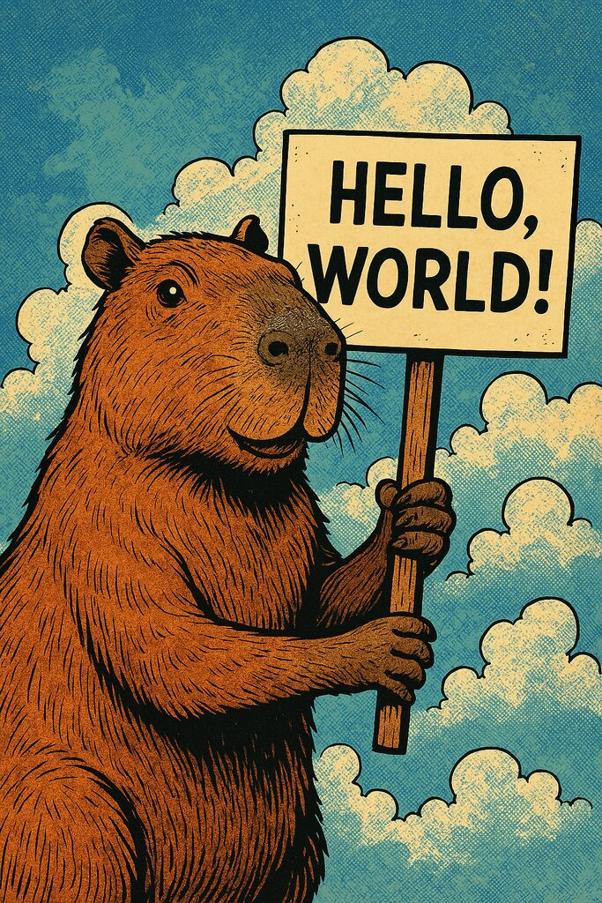

# `prompt-scaler`: High-volume production LLM client

> **NOTE:** This is a work in progress! It's under very active development and not all features are implemented yet.

`prompt-scaler` is a tool for running large numbers of LLM requests in parallel, and getting JSON results using structured output. This is most useful when:

1. You have a lot of requests to run, but
2. You can't afford to wait for the 24-hour turnaround guarantee for an LLM's batch API. (We _do_ plan to provide integrated support for using the batch API.)

## Environment

The following variables can be specified in the environment, or using a `.env` file:

- `OPENAI_API_KEY`: API key for OpenAI
- `OPENAI_API_BASE` (optional): Base URL for an alternate implementation of the OpenAI API, for use with tools like LiteLLM or Ollama.
- `RUST_LOG` (optional): Set to `prompt_scaler=debug,warn` or `prompt_scaler=trace,warn` to produce detailed logs. This uses the [`env-logger` syntax](https://docs.rs/env_logger/latest/env_logger/).

## Example usage

`prompt-scaler` is invoked as a command-line tool:

```sh
prompt-scaler chat tests/fixtures/input.csv \
    --prompt tests/fixtures/prompt.toml \
    --schema tests/fixtures/schema.json \
    --model gpt-4o-mini \
    --out output.json
```

Given the input:

```csv
id,joke
road,Why did the chicken cross the road?
doctor,Why did the chicken go to the doctor?
```

...plus an appropriate prompt and schema, this will produce [JSON Lines](https://jsonlines.org/) (JSONL) output like:

```jsonl
{"id":"road","response":{"punchline":"To get to the other side!"}}
{"id":"doctor","response":{"punchline":"He wasn't feeling very chicken!"}}
```

For example input and output files, see:

- [input.csv](./tests/fixtures/input.csv) or [input.jsonl](tests/fixtures/input.jsonl): Input data in either CSV or JSONL format.
- [prompt.toml](./tests/fixtures/prompt.toml): Example prompt template. Values from the input file will be filled in using [Handlebars](https://handlebarsjs.com/) templates.
- [schema.json](./tests/fixtures/schema.json): A [JSON Schema](https://json-schema.org/) generated from [schema.py](./tests/fixtures/schema.py), specifying the output we want receive. The `description=` fields will be passed to the LLM.

### Example image usage

Let's say we have three images of various beings holding signs:

  

We'll hold out the turtle for use as an example image, and create a CSV file describing the other two:

```csv
id,path
1,tests/fixtures/images/capybara.jpg
2,tests/fixtures/images/alien.jpg
```

#### Defining the schema

Next, we need to define our output format. For example, if we have the following TypeScript:

```ts
/**
 * Information extracted from an image.
 */
interface ImageInfo {
    /** Text appearing on the sign in the image. */
    sign_text: string;
    /** A one-word description of the entity holding the sign. */
    sign_holder: string;
}
```

...we could convert it to a JSON Schema as follows:

```sh
npx typescript-json-schema \
    --required --strictNullTypes --noExtraProps \
    -o tests/fixtures/images/schema.json \
    tests/fixtures/images/schema.ts ImageInfo
```

#### Providing a prompt

Now we can define out prompt, using the `image-data-url` helper to include the images:

```toml
# Place the actual instructions in the developer message.
#
# The schema will also be provided to the model automatically.
developer = """
Extract the specified information from the supplied images.
"""

# We provide an of what we want, using the turtle image.
#
# Including 1-3 examples will often produce much better output.
[[messages]]
user.images = ["{{image-data-url 'tests/fixtures/images/turtle.jpg'}}"]

# Expected output.
[[messages]]
assistant.json.sign_text = "Go!"
assistant.json.sign_holder = "Turtle"

# The prompt which contains our actual input.
[[messages]]
user.images = ["{{image-data-url path}}"]
```

#### Running the LLM

Finally, we could analyze our images as follows:

```sh
prompt-scaler chat tests/fixtures/images/input.csv \
    --prompt tests/fixtures/images/prompt.toml \
    --schema tests/fixtures/images/schema.json
```

This will produce the following output:

```jsonl
{"id":"1","response":{"sign_holder":"Capybara","sign_text":"HELLO, WORLD!"}}
{"id":"2","response":{"sign_holder":"Alien","sign_text":"TAKE US TO YOUR LLMS, PLEASE"}}
```

This JSONL output can be easily converted to CSV or another format using Python. If you provide sample input and output, your favorite LLM can probably write the script for you!

## License

License TBD, probably MIT+Apache 2, like Rust.

Copyright 2025 Elevate.
Some earlier code copyright ???? Eric Kidd.
